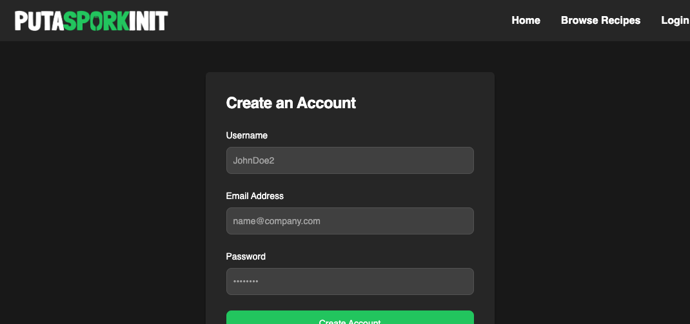
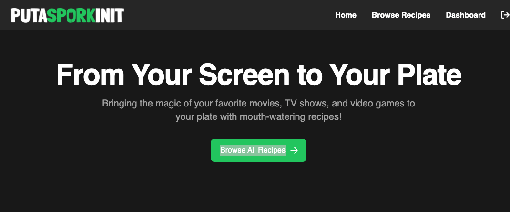

# PutASporkInIt
  
Welcome to PutASporkInIt, the virtual kitchen for pop culture fans! Our mission is to bring the magic of your favorite TV shows, movies, and video games to your plate, with mouth-watering recipes that will make you feel like a hero in the kitchen. Join our community, share your recipes, and discover new culinary adventures!
  
  
## Table of Contents

- [Technologies Used](#technologies-used)
- [Installation](#installation)
- [Usage](#usage)
- [Contributing](#contributing)
- [Tests](#tests)
- [Project Links](#project-links)
- [License](#license)
- [Questions](#questions)

## Technologies Used

## Installation

Please follow these steps to install and run the project on your local machine:

1. You will need to run `npm i` to install project dependencies.
2. You need to run the `db/schema.sql` file to create the database.
3. You will need to create a `.env` variable
4. You will need to run node `db/seeds` to initialize the database.
  
## Usage
  
To use this project, follow these steps:
1. Go to the site and create an account: www.putasporkinit.co/
2. Click `Browse All Recipes`. 
3. Search through to find a recipe that you would like to try.
4. Choose your favorite recipes by clicking the `heart` icon and give it an `up-vote` or `down-vote`.

## Contributing

This project is not currently open for contributions.

## Tests

To run tests on this project, follow these steps:
Feeling creating? Go to `Dashboard` and add your own recipes for other users to use!
Browse all of your favorite recipes from the `Dashboard`.
Testing instructions coming in a future update.
  
## Project Links
  
Deployed Application: www.putasporkinit.co/

Github Repository: https://github.com/CodeByDex/PutASporkInIt

Team: [CodeByDex](https://github.com/CodeByDex), [Cyanasaurusrex](https://github.com/Cyanasaurusrex), [ChelseaLuevano](https://github.com/ChelseaLuevano), [that_devguy](https://github.com/that_devguy), [Christianmsm](https://github.com/Christianmsm), [jxmart](https://github.com/jxmart)

## License

## Questions

If you have any questions or issues, feel free to reach out to me via my GitHub profile: [CodeByDex](https://github.com/CodeByDex)